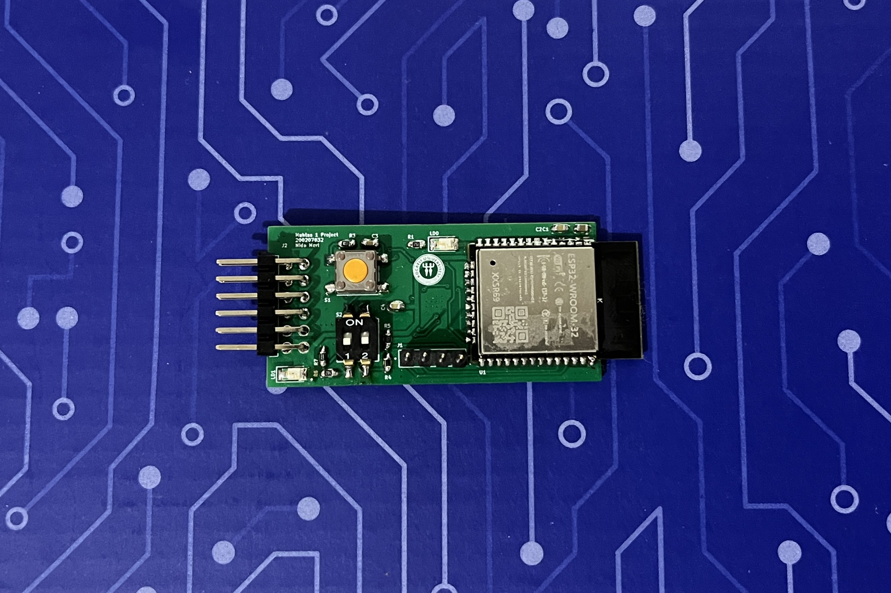

# MuhTas-1 Project PMOD ESP32

**Overview**
---
This project focuses on the design and testing of a custom 2-layer PMOD ESP32 module, closely resembling Digilent's PMOD ESP32 product. The PMOD ESP32 module provides Wi-Fi and Bluetooth connectivity, making it an ideal choice for embedded systems and IoT applications that require wireless communication. The module is designed to interface seamlessly with microcontrollers and FPGAs via the PMOD interface, enabling rapid prototyping and testing.

The functionality of the designed PMOD ESP32 board will be verified by sending AT commands through an STM32 microcontroller.

This repository includes:
- **Hardware Design Files** for the custom PMOD ESP32 board.
- **Firmware and Documentation** for the ESP32-WROOM-32 module.
- **Testing Examples** demonstrating STM32-based communication using AT commands.

The project serves as a practical solution for developers seeking an easy-to-use wireless module for their embedded systems.

**Project Structre**
---
- **Documentation/**: Contains connection diagrams for STM32-PMOD ESP32 / PMOD ESP32-USB TTL Converter and datasheets for components.
- **Firmware/ESP32-WROOM-32-AT-V3.4.0.0/**: Includes ESP32 Wroom 32 firmware files, user guides, release notes, and other documentation related to ESP32-WROOM-32-AT V3.4.0.0.
- **Hardware Designs/**: Contains hardware design files for the PMOD ESP32 module in 2-layer and 4-layer configurations.
- **Images/**: The photos of the PMOD ESP32 module before and after soldering, as well as the photos of the completed connections, are located in this folder.
- **Library/**: The libraries of components that are necessary for the project but are not available in the KiCad library are located in this folder.
- **STM32 Applications/**: Includes STM32 Cube IDE application and logic analyzer test results.
- **.gitmodules**: Configuration file for Git submodules.
- **README.md**: This file provides an overview of the project and instructions.

**Version Comparison**
---
- Between v0.1 and v0.2 of the PCB, the only difference lies in the routing; in v0.2, the placement and number of vias were optimized to enhance signal integrity and streamline the overall layout.
- **Branch Links of Versions** :  
[PMOD_ESP32_2Layers_v0.1](https://gitlab.com/Training_Academic/muhtas1/200207032_NidaMert_Muhtas1/-/tree/PMOD_ESP32_2Layers_v0.1): Initial version of the PCB.  
[PMOD_ESP32_2Layers_v0.2](https://gitlab.com/Training_Academic/muhtas1/200207032_NidaMert_Muhtas1/-/tree/PMOD_ESP32_2Layers_v0.2): Updated version with optimized routing.

**Connection Diagrams**
---

**References**
---
This project was developed based on the Digilent product: [[here](https://digilent.com/reference/pmod/pmodesp32/start?redirect=1)]. The design and implementation closely resemble this product, with some modifications.

**Cloning the Project**
---
To clone this project, follow these steps:
- First, make sure you have Git installed on your machine.
- Open Git Bash.
- Run the following command to clone the repository:
> git clone https://gitlab.com/Training_Academic/muhtas1/200207032_NidaMert_Muhtas1.git
